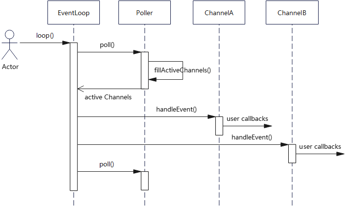
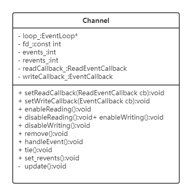

>此学习笔记主要记录对Muduo源码的理解，主要参考陈硕的《Linux多线程服务端编程》，其他的参考资料会列于笔记末尾。水平有限，若有错误请在我的[阅读笔记项目](https://github.com/zhang-xh95/xjexx/issues)中指出。如果觉得写得还不错，可以点个小星星。

#### Channel类对象

`Channel`对象负责一个文件描述符`fd`的**IO事件监听及分发**，但`fd`的生命周期不受`Channel`管理，因此不会在析构时关闭fd。用户不直接使用`Channel`，而是利用更上层的封装，例如`TcpConnection`。`Channel`涉及的主要时序如下：



`EventLoop::loop()`函数会调用`Poller::poll()`函数，返回一个包含当前激活的`Channel`（发生了监听的events or 错误），然后逐个调用激活`Channel`的`handleEvent()`函数（实际会调用`handleEventWithGuard`完成），进行不同事件的处理。

`Channel`一般是其他类的直接或间接成员，生命周期由`OwnerClass`管理。举个栗子，`EventLoop`的成员`wakeupChannel_`通过`std::unique<Channel>`智能指针管理`Channel`的生命周期，这个`Channel`是用于唤醒(EventLoop)线程的，具体可见[EventLoop分析笔记](www.chunhuaup.top)。

`Channel`的两大主要职责:

**IO事件监听**：
监听过程由`Poller`完成，可见[Poller分析笔记](www.chunhuaup.top)。`Channel`给`Poller`提供目标文件描述符`fd`需要监听的事件，例如可读事件`POLLIN`，可写事件`POLLOUT`等。其实也就是设置`pollfd events`相关的内容(这里以`poll为例`)：

```c
// POLL(2) Linux Programmer's Mannual
struct pollfd {
   int   fd;         /* 文件描述符 */
   short events;     /* 感兴趣的事件类型*/
   short revents;    /* 发生的事件类型 */
};
```

当然了，`Channel`需要提供一些接口给user设置需要监听的事件类型，通过各种`enable*`和`disable*`成员函数搞定，具体见后面源码分析。

**IO事件分发**：

`Channel`所监听事件`rvents`发生后，`Poller`通过`Channel::set_revents(int revt)`设置`Channel::revents_`成员变量。后续执行哪些事情(**执行回调函数**)通过`Channel::handleEvent`分发，例如`fd`可写后，会调用`writeCallback`。`writeCallback`这些回调函数也通过`Channel::set*Callback`接口进行设置。

```c++
void set_revents(int revt) { revents_ = revt; } 
```
#### Channel源码分析
**Channel类对象重要成员**：




**监听事件管理**：
1. `enableReading()`： 开启读事件监听
2.  `enableWriting()`：开启写事件监听
3. `disableReading()` ：关闭读事件监听
4.  `disableWriting()`：关闭写事件监听
5.  `disableAll()`：关闭读写事件监听

以读事件代码为例：
```c++
 const int Channel::kReadEvent = POLLIN | POLLPRI;
 const int Channel::kWriteEvent = POLLOUT;
 
  void Channel::enableReading() 
  { 
        events_ |= kReadEvent; 
        update(); 
   }
   
  void Channel::disableReading()
  {
        events_ &= ~kReadEvent; 
        update(); 
   }

  void Channel::update()
  {
      addedToLoop_ = true;
      loop_->updateChannel(this);
  }
```
**回调函数设置**：
```c++
  void setReadCallback(ReadEventCallback cb)
  { readCallback_ = std::move(cb); }
  void setWriteCallback(EventCallback cb)
  { writeCallback_ = std::move(cb); }
```
**handleEvent事件处理**

事件分发的主要逻辑，即根据`revents_`的内容调用不同的回调函数。

```c++
void Channel::handleEventWithGuard(Timestamp receiveTime)
{
      eventHandling_ = true;
      // the peer closed its end of the channel and
      // no data to read
      if ((revents_ & POLLHUP) && !(revents_ & POLLIN))
      {
            if (closeCallback_) closeCallback_();
      }
      //  error condition or
      // invalid request: fd not open
      if (revents_ & (POLLERR | POLLNVAL))
      {
            if (errorCallback_) errorCallback_();
      }
      // there is data to read or
      // urgent data to read or
      // stream socket peer closed connection, or shut down writing half of connection.
      if (revents_ & (POLLIN | POLLPRI | POLLRDHUP))
      {
            if (readCallback_) readCallback_(receiveTime);
      }
      // writing is now possible
      if (revents_ & POLLOUT)
      {
            if (writeCallback_) writeCallback_();
      }
      eventHandling_ = false;
}
```
**tie weak_ptr**：
```c++
 /* 
  * tie是weak_ptr: 目的是防止Owener Object在Channel执行handleEvent的时候被析构了
  * handleEvent中执行的回调函数其实是TcpConnection中的成员函数，如果析构了就G
  * Muduo中Owner Object其实就是TcpConnection
  * 当然Owenner Object必须是由shared_ptr管理的
  */ 
void Channel::tie(const std::shared_ptr<void>& obj)
{
      tie_ = obj;
      tied_ = true;
}
/*
 * 防止的手段就是weak_ptr.lock()尝试提升为shared_ptr
 * 提升不成功说明已经被析构了 就不执行handleEventWithGuard
 * 提升成功Owner Object不会在handleEventWithGuard中被析构
 */
void Channel::handleEvent(Timestamp receiveTime)
{
      std::shared_ptr<void> guard;
      if (tied_)
      {
            guard = tie_.lock();
            if (guard)
            {
                handleEventWithGuard(receiveTime);
            }
      }
      else
      {
            handleEventWithGuard(receiveTime);
      }
}
```
