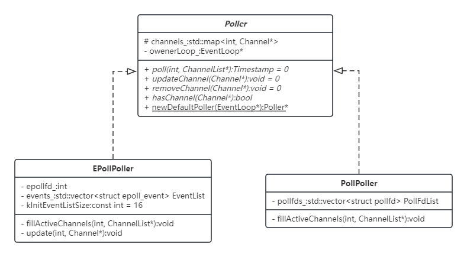

>此学习笔记主要记录对Muduo源码的理解，主要参考陈硕的《Linux多线程服务端编程》，其他的参考资料会列于笔记末尾。水平有限，若有错误请在我的[阅读笔记项目](https://github.com/zhang-xh95/xjexx/issues)中指出。如果觉得写得还不错，可以点个小星星。


#### Poller介绍

`Poller class`是`IO multiplexing`的封装，在`muduo`网络库中是一个抽象基类，`muduo`同时支持`poll(2)`和`epoll(7)`两种机制，`epoll(7)`采用水平触发。这个会在后面源码分析部分讲到。`Poller`是`EventLoop`的间接成员，由`EventLoop`对象利用`std::unique_str`智能指针管理，生命周期`EventLoop`相同。`owner EventLoop`在IO线程调用`Poller::poll`，无须加锁。`Poller`并不拥有`Channel`, `Channel`析构之前必须自己`unregister`, (`Channel::remove -> EventLoop:removeChannel -> Poller::removeChannel`)。

接下来我们首先介绍下`IO multiplexing`，然后分析下`Poller`相关的源码。


#### IO Multiplexing
`I/O多路复用`允许程序**同时监视多个文件描述符**，等待其中一个或多个文件描述符变为**就绪**，以执行相应的I/O操作（例如，`read(2)`或`write(2)`）。**复用**指的是复用一个线程、使用一个线程来检查多个文件描述符（Socket）的就绪状态。Linux下，实现I/O复用的系统调用主要有3个：1）`select(2)`；2）`poll(2)`；3）`epoll(7)`。muduo采用了`poll`和`epoll`，分别用`PollPoller/EPollPoller`进行了封装，基类`Poller`用于提供统一的接口。

I/O多路复用最好搭配非阻塞IO食用：

> On Linux, select/poll/epoll may report a socket file descriptor as "ready for reading", while nevertheless a subsequent read blocks.  This could for example happen when data has arrived but upon examination has the wrong checksum and is discarded.  There may be other circumstances in which a file descriptor is spuriously reported as ready.  Thus it may be safer to use O_NONBLOCK on sockets that should not block.

##### poll(2)
`poll()`调用的声明如下:
```c
int poll(struct pollfd *fds, nfds_t nfds, int timeout);
```
`fds`和`nfds`标识一个数组`pollfds`，其中包含了所有被监视的描述符及相应的事件，每个被监视的文件描述符及其事件数组用`struct pollfd`表示。网络库中`Channel`的数据成员其实就对应于`struct pollfd`的组成。
```c
struct pollfd {
   int   fd;         /* 文件描述符 */
   short events;     /* 监视的事件 */
   short revents;    /* 返回的事件 */
};
```
`poll()` 系统调用是同步`IO`, 会一直阻塞直到:
- 某个文件描述符就绪
- the call is interrupted by a signal handler
- 超时

`poll()`调用的返回值有以下几种情况：
- 0: 超时
- 正数: 会返回一个非负的整数，表示`pollfds`数组中有多少个元素发生了监视的事件或者错误
- -1: poll发生了错误

常用的事件类型：
| 事件 | 含义 |
| --- | --- |
| POLLIN | 有数据要读取 |
| POLLPRI | 通常是urgent data to read |
| POLLOUT | 可写 |
| POLLRDHUP | Stream socket peer closed connection, or shut down writing half of connection. |
| POLLERR | 错误 |
| POLLHUP | 挂断。在Tcp连接中通常表示对端`close`。Subsequent reads from the channel will return 0 (end of file) only after all outstanding data in the channel has been consumed |
| POLLNVAL | 不合法的操作：fd not open |
`POLLERR`, `POLLHUP`和`POLLNVAL`标识异常信息的仅会在返回的`revents`中，设置在`events`会被忽略。


##### epoll(7)
`epoll(7)`系统调用和`poll(2)`类似：监控多个文件描述符，找出其中可以进行`I/O`的文件描述符。 它具有两种模式，一是边缘触发（edge-triggered），二是水平触发（level-triggered）。

epoll 的核心概念是 epoll 实例（epoll instance），这是内核的一个内部数据结构，从用户空间的角度看，它可以被看作一个内含两个列表的容器：

兴趣列表（interest list）：一个集合包含需要监控的所有文件描述符及其事件。
就绪列表（ready list）：“准备好”进行 I/O 的文件描述符的集合。就绪列表是兴趣列表中的文件描述符的子集。内核会根据这些文件描述符上的 I/O 活动动态地填充就绪列表。

使用 epoll 分为三步：

1. 调用`epoll_create1(2)` 创建一个新的 epoll 实例，并返回一个指向该实例的文件描述符。
2. 调用`epoll_ctl(2)` 向 epoll 实例的*兴趣列表*中添加项目，注册对特定文件描述符需要监控的事件。
> This  system  call  is  used to add, modify, or remove entries in the interest list of the epoll(7) instance referred to by the file descriptor epfd.  It requests that the operation op be performed for the target file descriptor, fd.
> Valid values for the op argument are:
> - `EPOLL_CTL_ADD`: Add fd to the interest list and associate the settings specified in event with the internal file linked to fd.
> - `EPOLL_CTL_MOD`: Change the settings associated with fd in the interest list to the new settings specified in event.
> - `EPOLL_CTL_DEL`:  Remove (deregister) the target file descriptor fd from the interest list.  The event argument is ignored and can be NULL (but see BUGS below).

3. 调用`epoll_wait(2)` 等待 I/O 事件，如果当前没有事件可用，则阻塞调用它的线程。（此系统调用可被看作从 epoll 实例的就绪列表中获取项目。）

**水平触发 v.s. 边缘触发**:

假设发生下列情况：
1.读取方在 epoll 实例中注册代表管道读取端（rfd）的文件描述符。
2. 写入方在管道的写入端写入 2 kB 的数据。
3. 读取方调用 `epoll_wait(2)`， rfd 作为一个就绪的文件描述符被返回。
4. 读取方只从 rfd 中读取 1 kB 的数据。
5. 读取方再次调用 `epoll_wait(2)`。

如果读取方添加 rfd 到 epoll 接口时使用了 EPOLLET （边缘触发）标志位，那么纵使此刻文件输入缓冲区中仍有可用的数据（剩余的1 KB 数据），步骤5中的`epoll_wait(2)` 调用仍可能会挂起；与此同时，写入方可能在等待读取方对它发送的数据的响应。造成这种互相等待的情形的原因是边缘触发模式只有在被监控的文件描述符发生变化时才会递送事件。因此，在步骤5中，读取方最终可能会为一些已经存在于自己输入缓冲区内的数据一直等下去。在上面的例子中，由于写入方在第2步中进行了写操作， rfd 上产生了一个事件，这个事件在第3步中被读取方消耗了。但读取方在第4步中进行的读操作却没有消耗完整个缓冲区的数据，因此在第5步中对`epoll_wait(2)` 的调用可能会无限期地阻塞。

使用 EPOLLET 标志位的应用程序应当使用非阻塞的文件描述符，以避免（因事件被消耗而）使正在处理多个文件描述符的任务因阻塞的读或写而出现饥饿。将 epoll用作边缘触发（EPOLLET）的接口，建议的使用方法如下：

a) 使用非阻塞的文件描述符；
b) 只在 `read(2)` 或 `write(2)` 返回 EAGAIN 后再等待新的事件。

当作为水平触发的接口使用时（默认情况，没有指定 EPOLLET）， epoll 只是一个更快的 `poll(2)`，可以用在任何能使用 `poll(2)` 的地方，因为此时两者的语义相同。

#### Poller源码分析
##### Poller
`Poller`是抽象基类，`EPollPoller`, `PollPoller`分别是使用`epoll`和`poll`的派生类：



`Poller`提供了`Poller::hasChannel(Channel*)`成员函数的具体实现，用于判断`Channel`是否由`Poller`监听。

```c++
/*
 * channels_  map维护 fd->Channel* 
 */
bool Poller::hasChannel(Channel* channel) const
{
  assertInLoopThread();
  ChannelMap::const_iterator it = channels_.find(channel->fd());
  return it != channels_.end() && it->second == channel;
}
```

此外，`Poller::newDefaultPoller(EventLoop*)`静态成员函数基于环境变量获取具体的`Poller`实例

```c++
Poller* Poller::newDefaultPoller(EventLoop* loop)
{
  if (::getenv("MUDUO_USE_POLL"))
  {
    return new PollPoller(loop);
  }
  else
  {
    return new EPollPoller(loop);
  }
}
```

下面分别介绍`PollerPoller`和`EPollerPoller`实现的`poll`方法，阻塞等待有Channel被激活。以及部分对`Channel`进行管理, *说是管理，其实把Channel的更新同步到监听*的方法实现。

##### PollPoller

`PollerPoller`增加`pollfds_: std::vector<struct pollfd>`数据成员。

**poll**

```c++

/* 使用poll监听`pollfds_: std::vector<struct pollfd>`
 * 等待多个文件描述符目标事件的发生
 * 事件发生则调用fillActiveChannels去更新对应激活Channel中的revents_
 * 然后返回激活的ChannelList
 */
Timestamp PollPoller::poll(int timeoutMs, ChannelList* activeChannels)
{
  // XXX pollfds_ shouldn't change
  int numEvents = ::poll(&*pollfds_.begin(), pollfds_.size(), timeoutMs);
  int savedErrno = errno;
  Timestamp now(Timestamp::now());
  // numEvents：the number of descriptors that are ready for I/O
  if (numEvents > 0)
  {
    fillActiveChannels(numEvents, activeChannels);
  }
  // the time limit expires, poll() returns 0.
  else if (numEvents == 0)
  {
    LOG_TRACE << " nothing happened";
  }
  // error occur
  else
  {
    // EINTR: nfds value exceeds the RLIMIT_NOFILE value.
    if (savedErrno != EINTR)
    {
      errno = savedErrno;
      LOG_SYSERR << "PollPoller::poll()";
    }
  }
  return now;
}

/* 
 * 遍历pollfds_，找出激活的（revents>0）
 * 然后更改对应Channel的revents
 * 增加Channel到激活的Channel列表
 */ 
void PollPoller::fillActiveChannels(int numEvents,
                                    ChannelList* activeChannels) const
{
  for (PollFdList::const_iterator pfd = pollfds_.begin();
      pfd != pollfds_.end() && numEvents > 0; ++pfd)
  {
    if (pfd->revents > 0)
    {
      --numEvents;
      ChannelMap::const_iterator ch = channels_.find(pfd->fd);
      assert(ch != channels_.end());
      Channel* channel = ch->second;
      assert(channel->fd() == pfd->fd);
      channel->set_revents(pfd->revents);
      activeChannels->push_back(channel);
    }
  }
}
```

**Channel更新及删除**

```c++

// 更新Channel
void PollPoller::updateChannel(Channel* channel)
{
  // 必须在EventLoop thread进行 否则可能会和Poll冲突，导致pollfds_迭代器失效
  Poller::assertInLoopThread();
  
  if (channel->index() < 0)
  {
    // a new one, add to pollfds_
    // 新增插入集合，并基于Channel信息构建struct pollfd放入vector，后续用于poll
    struct pollfd pfd;
    pfd.fd = channel->fd();
    pfd.events = static_cast<short>(channel->events());
    pfd.revents = 0;
    pollfds_.push_back(pfd);
    int idx = static_cast<int>(pollfds_.size())-1;
    channel->set_index(idx);
    channels_[pfd.fd] = channel;
  }
  else
  {
    // update existing one
    // 判断是否存在 省略判断逻辑
    // 状态更新
    int idx = channel->index();
    struct pollfd& pfd = pollfds_[idx];
    pfd.fd = channel->fd();
    pfd.events = static_cast<short>(channel->events());
    pfd.revents = 0;
    // 当前这个fd没有需要监听的事件 ignore this pollfd
    // POLL(2): This provides an easy way of ignoring a file descriptor for a single poll() call: simply set the fd field to its bitwise complement.
    if (channel->isNoneEvent())
    {
      pfd.fd = -channel->fd()-1;
    }
  }
}

// 删除监听的channel
void PollPoller::removeChannel(Channel* channel)
{
  Poller::assertInLoopThread();
  // 省略判断逻辑
  // 删除channels_ map中信息
  // 删除pollfds_ 信息
  int idx = channel->index();
  const struct pollfd& pfd = pollfds_[idx]; (void)pfd;
  size_t n = channels_.erase(channel->fd());
  assert(n == 1); (void)n;
  if (implicit_cast<size_t>(idx) == pollfds_.size()-1)
  {
    pollfds_.pop_back();
  }
  else
  {
    // 和末位struct pollfd互换
    // 然后pop_back()
    int channelAtEnd = pollfds_.back().fd;
    iter_swap(pollfds_.begin()+idx, pollfds_.end()-1);
    if (channelAtEnd < 0)
    {
      channelAtEnd = -channelAtEnd-1;
    }
    channels_[channelAtEnd]->set_index(idx);
    pollfds_.pop_back();
  }
}
```

##### EPollerPoller

**poll**

```c++
/* 利用epoll_wait系统调用poll，和PollPoller逻辑没啥区别
*/
Timestamp EPollPoller::poll(int timeoutMs, ChannelList* activeChannels)
{
  LOG_TRACE << "fd total count " << channels_.size();
  int numEvents = ::epoll_wait(epollfd_,
                               &*events_.begin(),
                               static_cast<int>(events_.size()),
                               timeoutMs);
  int savedErrno = errno;
  Timestamp now(Timestamp::now());
  if (numEvents > 0)
  {
    fillActiveChannels(numEvents, activeChannels);
    if (implicit_cast<size_t>(numEvents) == events_.size())
    {
      events_.resize(events_.size()*2);
    }
  }
  else if (numEvents == 0)
  {
    LOG_TRACE << "nothing happened";
  }
  else
  {
    // error happens, log uncommon ones
    if (savedErrno != EINTR)
    {
      errno = savedErrno;
      LOG_SYSERR << "EPollPoller::poll()";
    }
  }
  return now;
}
// 填充激活的Channel。epoll wait返回时events_中前numEvents元素都是激活的，所以下面这个函数逻辑也会更简单
void EPollPoller::fillActiveChannels(int numEvents,
                                     ChannelList* activeChannels) const
{
  assert(implicit_cast<size_t>(numEvents) <= events_.size());
  for (int i = 0; i < numEvents; ++i)
  {
    Channel* channel = static_cast<Channel*>(events_[i].data.ptr);
    channel->set_revents(events_[i].events);
    activeChannels->push_back(channel);
  }
}
```

**Channel管理**

`EPollPoller`与`PollPoller`主要在这个部分区别较大，毕竟`poll`是直接传一个数组，简单粗暴，而`epoll`需要调用`epoll_ctl(2)`进行增删改。
```c++
// Channel更新
void EPollPoller::updateChannel(Channel* channel)
{
  Poller::assertInLoopThread();
  const int index = channel->index();
  // Channel默认为kNew
  // 需要进行新增操作
  if (index == kNew || index == kDeleted)
  {
    // a new one, add with EPOLL_CTL_ADD
    int fd = channel->fd();
    // 确定是kNew or kDeleted 判断省略
    channel->set_index(kAdded);
    update(EPOLL_CTL_ADD, channel);
  }
  else
  {
    // update existing one with EPOLL_CTL_MOD/DEL
    // 更新已有的Channel 修改或删除
    int fd = channel->fd();
    // 判断确实是当前已添加在监听的Channel 判断省略...
    // 需要取消监听该Channel
    if (channel->isNoneEvent())
    {
      update(EPOLL_CTL_DEL, channel);
      channel->set_index(kDeleted);
    }
    // 需要修改监听的事件类型
    else
    {
      update(EPOLL_CTL_MOD, channel);
    }
  }
}

void EPollPoller::removeChannel(Channel* channel)
{
  Poller::assertInLoopThread();
  int fd = channel->fd();
  // 确定存在该Channel&&目前没有任何监听 判断过程省略
  int index = channel->index();
  size_t n = channels_.erase(fd);
  // 重制Channel状态
  if (index == kAdded)
  {
    update(EPOLL_CTL_DEL, channel);
  }
  channel->set_index(kNew);
}
// epoll_ctl的一个封装，便于更好的使用
void EPollPoller::update(int operation, Channel* channel)
{
  struct epoll_event event;
  memZero(&event, sizeof event);
  event.events = channel->events();
  event.data.ptr = channel;
  int fd = channel->fd();
  if (::epoll_ctl(epollfd_, operation, fd, &event) < 0)
  {
    if (operation == EPOLL_CTL_DEL)
    {
      LOG_SYSERR << "epoll_ctl op =" << operationToString(operation) << " fd =" << fd;
    }
    else
    {
      LOG_SYSFATAL << "epoll_ctl op =" << operationToString(operation) << " fd =" << fd;
    }
  }
}

```


